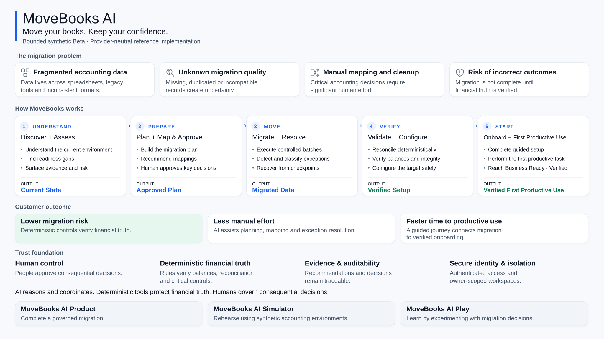
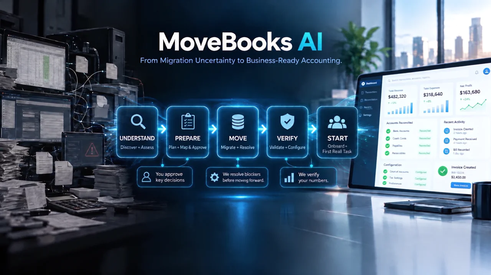

# MoveBooks AI

> **V1.0 — Bounded Synthetic Public Beta**
>
> **Move your books. Keep your confidence.**
>
> Agentic accounting migration and onboarding with deterministic financial controls,
> human governance and verified First Productive Use.

MoveBooks AI is an independent, provider-neutral product concept from **Movers & Ledgers**.
It helps business owners and finance operators—supported by accountants and migration
specialists—understand, prepare for, execute, validate and adopt an accounting migration,
while keeping consequential financial decisions governed and verifiable.

It does not represent or disclose the internal products, architecture, APIs, roadmap or
implementation of Intuit, QuickBooks or any other accounting provider.

## Live Beta

[**Open the public Beta →**](https://movebooks-si.web.app)
· [V1.0 release](https://github.com/JEMathew/movers-and-ledgers/releases/tag/v1.0.0)
· [Repository](https://github.com/JEMathew/movers-and-ledgers)
· [User Guide](https://movebooks-si.web.app/guide)
· [Trust & evidence](docs/TRUST.md)

**Bounded synthetic Beta · No production customer/provider data · No production/compliance claim**

Browse public experiences without signing in; Google sign-in is required for owner-scoped
workspaces. Use synthetic scenarios only. Hosted **Try Your Data uploads are disabled**.
The public deployment uses deterministic-only reasoning; bounded live Gemini/ADK advisory
validation is separate from deployment activation.



[Editable overview](docs/assets/movebooks-product-overview.svg) ·
[High-resolution PNG for presentations](docs/assets/movebooks-product-overview.png).
On mobile, open the image to zoom; the journey and trust model are also described below.

## Product Vision

[](https://movebooks-si.web.app/#product-vision)

Watch the 25-second narrated MoveBooks AI product vision.

**Product Vision** illustrates the intended customer experience and product direction.
**Live Beta** is the currently implemented and validated experience. A **Demo** would be an
actual product-screen walkthrough; this film is not one and does not imply every depicted
screen or provider connection is implemented.

**Reference implementation:** This public repository is provided primarily for demonstration, evaluation, learning, and portfolio purposes. MoveBooks AI and Movers & Ledgers remain independent product concepts. Public access to the repository does not by itself grant rights to commercially reproduce, rebrand, resell, or redistribute the product beyond the permissions explicitly provided in the repository license.

## The Migration Problem

Accounting migrations leave teams asking both **“Did the data move correctly?”** and
**“Can we operate confidently now?”**

- Fragmented accounting data across spreadsheets, legacy tools and inconsistent formats.
- Incomplete, duplicated or incompatible records that obscure migration readiness.
- Manual mapping and cleanup that consume expert time.
- Migration and reconciliation risk when transfer success is mistaken for correctness.
- Disconnected migration and onboarding, with no clear proof of business readiness.

Migration should end at productive use, not file transfer. MoveBooks connects the
full journey through five customer-facing phases:

**UNDERSTAND → PREPARE → MOVE → VERIFY → START**

Discover → Assess → Plan → Map & Approve → Migrate → Resolve → Validate → Configure
→ Onboard → **Verified First Productive Use**

Completion means an authorized user performs an agreed productive task after required
controls pass. In this Beta, that proof is a synthetic invoice with exact financial
verification—not a claim that a real business has been migrated.
See the [product constitution](docs/PRODUCT_CONSTITUTION.md) and
[First Productive Use contract](docs/architecture/onboard-fpu.md).

## What Makes MoveBooks Different

1. **Productive use is the outcome.** Migration, setup and onboarding share one completion contract.
2. **Financial truth is deterministic.** Rules—not generated prose—verify balances and reconciliation.
3. **Humans govern consequential decisions.** Recommendations cannot approve themselves.
4. **Evidence-aware advice.** Recommendations expose references, uncertainty and escalation.
5. **Recovery is part of the journey.** Checkpoints, bounded retries and explicit reconsideration preserve prior decisions and audit history.
6. **Provider-neutral boundaries.** Source/target adapters separate accounting concepts from providers; real integrations remain future work.

## Product Architecture & Responsibility Model

**Rules verify. AI predicts. GenAI reasons. Agents orchestrate and act. Humans govern consequential decisions.**

Agents reason and coordinate within bounded roles. Deterministic tools protect financial
truth; lifecycle controls prevent unsafe progression. Humans approve consequential changes,
and evidence links decisions to attributable audit history. This responsibility model does
not imply every role uses a live model or that production predictive performance is established.

[Conceptual architecture](docs/architecture/README.md) ·
[Integrated journey](docs/architecture/beta-v1-integration.md) ·
[AI / Agent Constitution](docs/AI_AGENT_CONSTITUTION.md)

## Current V1 vs Future Scope

Future direction is not a delivery commitment or an implemented integration.

| Capability | V1.0 bounded Beta / validated source | Future direction |
| --- | --- | --- |
| Discover / Assess | Synthetic inventory, evidence and readiness rules | Broader connectors and discovery |
| Planning | Versioned plans, dependencies and checkpoints | Richer scenario optimization |
| Mapping | Evidence-backed proposals, human review and audit-preserving reconsideration | Provider-specific adapters |
| Migrate / Resolve | Governed synthetic batches, exceptions and recovery | Real provider integrations |
| Validation | Deterministic synthetic reconciliation and integrity checks | Production-grade provider validation |
| Configure | Human-approved synthetic target settings | Live provider configuration |
| Onboarding | Role-aware synthetic setup and approvals | Broader guided adoption |
| Verified FPU | Deterministically verified synthetic invoice | Production outcome instrumentation |
| Gemini / ADK | Five bounded advisory capabilities live-validated in dev/test; public Beta remains deterministic-only | Broader evaluated advice and managed runtime |
| Try Your Data | Controlled local/de-identified test exports; synthetic targets | Secure hosted ingestion after hardening |
| Play | Lightweight interactive migration learning | 2D interactive migration simulation |

## Agentic AI in MoveBooks

“Reasoning determines what should happen; orchestration determines who or what acts next,
under which rules.”

Discovery/Assessment gather evidence and expose readiness gaps. Planning and Mapping organize
proposals; Resolution explains exceptions; Configuration and Onboarding/Knowledge guide
governed setup. The Orchestrator controls stage handoffs and safe stops.
**Deterministic checks are tools, not agents.**

The five optional live advisors explain existing plans, mappings, failures, configuration
and onboarding evidence. They cannot approve, execute migration, retry, post invoices,
reconcile or declare FPU. Invalid/unavailable advice visibly falls back without bypassing controls.

[Full agent architecture](docs/architecture/beta-v1-agent-architecture.md) ·
[Canonical workflows](docs/architecture/AGENT_WORKFLOWS.md) ·
[Bounded Gemini / ADK design](docs/architecture/live-gemini-adk.md)

## Evaluation & Release Discipline

Product specifications are checked through golden cases, deterministic regressions,
agent/model semantic evaluations, security/identity negative paths, P0/P1 release gates,
bounded live Gemini tests and end-to-end acceptance. Offline contract evaluations are
not proof of model quality; bounded live cases are not production certification.

[Evaluation principles](docs/EVALUATION_PRINCIPLES.md) · [Golden cases](evals/) ·
[Product scorecard](docs/PRODUCT_SCORECARD.md) ·
[Agentic AI rubric](docs/rubrics/AGENTIC_AI_RUBRIC.md) ·
[Migration & Onboarding rubric](docs/rubrics/MIGRATION_ONBOARDING_RUBRIC.md) ·
[Release readiness](docs/RELEASE_READINESS.md)

## Product Outcome & Metrics

**North Star: Percentage of eligible migration journeys reaching Verified First Productive Use.**

Supporting contracts cover migration completion, time to productive use, mapping
acceptance/override, reconciliation success, exception/recovery rates, agent escalation/task
success and support-assisted migration. Assistance is diagnostic—not a condition for success.

These are **defined metric contracts for future production instrumentation**, not measured
production results. See the [metrics framework](docs/METRICS_FRAMEWORK.md).

## Trust by Design

Human approval, deterministic financial verification, attributable evidence, authenticated
owner isolation, bounded retries/idempotency and visible AI fallback work together.
An approval cannot turn a failed financial check into a pass. Reconsideration creates a
new governed decision without erasing the original rejection.

[Trust controls](docs/TRUST.md) · [Security threat model](docs/security/THREAT_MODEL.md) ·
[Reconsideration review](docs/reviews/mapping-reconsideration.md)

## Product Family

| Experience | Purpose |
| --- | --- |
| **MoveBooks AI Product** | Complete a governed migration and onboarding journey. |
| **MoveBooks AI Simulator** | Rehearse using synthetic accounting environments. |
| **MoveBooks AI Play** | Learn by experimenting with migration concepts and decisions; not yet a 2D game. |

**Learn** teaches concepts; **Guide** explains getting started and how-to tasks;
**Trust** makes controls/evidence inspectable. Feedback is a local draft, not a submitted
support ticket. [Surface boundaries](docs/architecture/public-product-surfaces.md).

## Google-Native Implementation

Next.js/TypeScript frontend and Python/FastAPI backend run in Cloud Run, with Cloud SQL /
PostgreSQL persistence and Google/Firebase identity. The web is public; the API is private,
reached through an authenticated server-side proxy. GCS supports permitted non-sensitive
artifacts, and Secret Manager supports runtime configuration.

Optional Google ADK bounded runners use Gemini via Vertex AI for synthetic advisory reasoning.
**Managed ADK hosting is not activated.** GitHub Actions covers regressions, dependency checks
and container/image security gates.

[Runtime architecture](docs/architecture/google-native-runtime.md) ·
[Cloud validation](docs/reviews/google-cloud-validation.md) ·
[Deployment and operations](docs/deployment/public-beta.md)

## Live / Current Status

Evidence is scoped and dated; a source capability is not automatically enabled in the live Beta.

| Gate | Recorded result and evidence |
| --- | --- |
| V1.0 release and final acceptance | Released; **GREEN** for bounded synthetic acceptance ([record](docs/reviews/v1-final-acceptance.md)). |
| Public-Beta V1 baseline | Live; original Safari identity/owner-isolation and financial controls passed. The post-merge test-fixture hold is resolved ([release checkpoint](docs/deployment/public-beta.md)). |
| Bounded Gemini / ADK | **GREEN** for exercised advisory cases, including accepted Mapping escalation ([final evidence](docs/reviews/live-gemini-adk-mapping.md)); not enabled in the public deployment. |
| Latest account-shell update | Deployed after V1; targeted Safari sign-in/session/sign-out confirmation remains pending. It is not a completed new live acceptance claim. |
| Main CI | [Seven jobs passed on ac95900](https://github.com/JEMathew/movers-and-ledgers/actions/runs/36681965187); historical checkpoint, not a permanent-green badge. |

No production customer data, real provider integrations, autonomous financial writes or
production/compliance readiness are claimed. Backup/restore hardening, cost/abuse monitoring,
residual Medium image advisories and UX simplification remain follow-ups.
[Evidence navigation](docs/README.md) separates final decisions from historical AMBER attempts.

## Quick Start & Engineering Checks

Prerequisites: Node.js 22+, Python 3.11+ (the Makefile defaults to `python3.11`);
Docker is optional.

```bash
make setup
make dev-api     # http://localhost:8000/docs
make dev-web     # http://localhost:3000
```

Or use `docker compose up --build`. Default local development is deterministic and needs
no Google credentials or paid cloud resources. Local demo identity is not public-Beta
authentication; controlled Try Your Data exports stay local/de-identified.

```bash
make test
make lint
python3 scripts/repository_checks.py
```

[Contributing](CONTRIBUTING.md) · [Documentation index](docs/README.md)

## Reference Use & Intellectual Property

MoveBooks AI is an independent product concept developed by **Movers & Ledgers**.

This repository is made publicly available primarily for **demonstration, learning, portfolio, evaluation, and reference purposes**.

The repository may be reviewed to understand the product concepts, architecture, agentic AI patterns, migration workflows, user experience, evaluation approaches, and engineering practices used in MoveBooks AI.

Public availability of this repository should not be interpreted as a waiver of intellectual property rights or as authorization to commercially reproduce, redistribute, rebrand, resell, or create substantially derivative commercial products from MoveBooks AI unless explicitly permitted by the applicable repository license.

Product names, branding, product concepts, proprietary migration intelligence, domain-specific knowledge assets, designs, documentation, datasets, and other intellectual property associated with **Movers & Ledgers** and **MoveBooks AI**remain subject to their respective intellectual property rights.

MoveBooks AI is an independent synthetic product concept and does not represent, reproduce, or claim to describe the internal products, systems, APIs, architectures, roadmaps, or implementation details of Intuit, QuickBooks, or any other accounting software provider.

Where third-party technologies, frameworks, libraries, trademarks, or services are referenced, those remain the property of their respective owners.

For permitted use of the source code, refer to the repository's `LICENSE` file.
