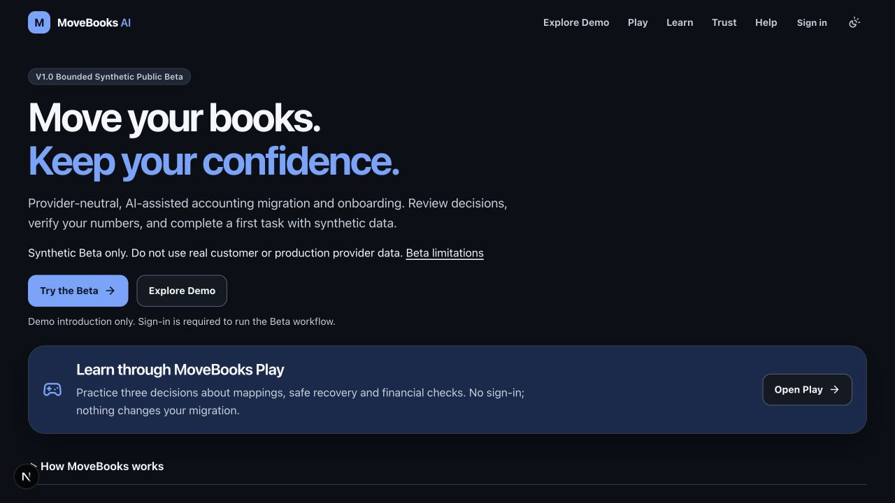
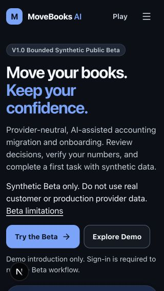

# PR01 — Public discovery and navigation review evidence

Baseline: `54141f2d9d70842503a9daffbecc3de8acbe79e2` (latest main fetched before implementation). Branch: `feature/ux-v2-public-discovery`. Captured and verified locally on 2026-10-10. No deployment or merge performed.

## Approved scope and resulting behavior

Uses the five completed local design deliverables in `movebooks-ia-v2-audit`: final IA, UX specification, wireframes, implementation plan and decision register. [Input hashes](design-inputs.json) identify the exact documents. Implements the implementation plan's PR01 only.

The homepage presents a concise provider-neutral accounting migration/onboarding proposition, the synthetic Beta warning, one primary **Try the Beta** action to `/workspace`, secondary **Explore Demo** to `/simulator`, and a prominent **Open Play** link to `/play`. Existing substantive explanations remain in native disclosures. The original 25-second Product Vision video, poster, playback controls and `#product-vision` anchor are preserved and explicitly labeled conceptual.

Public navigation: Explore Demo, Play, Learn, Trust; Help and the existing Google sign-in control as utilities. API-verified member navigation: My Migration, Play; Help and Account utilities. Account includes public discovery links. On mobile, Play stays visible beside Menu; navigation closes on selection, focus exit, outside pointer, Escape or desktop resize. The repeated header migration-launch button is removed.

**Demo remains the existing introduction, pending PR03. Play remains the existing three-decision exercise. No future tour or five-mission pixel game is implemented or advertised.** No deviation from approved PR01 scope. Native disclosures retain content until PR02 assigns deeper content ownership. Compact Google sign-in retains its existing SDK action and safe-return behavior.

## Before and after

Genuine local development screenshots, signed out in Firebase/cloud mode using public project configuration. Same browser, System appearance resolving to dark, dimensions and synthetic content in both versions. The development indicator is visible. These are not screenshots of a deployed change or authenticated account. Screenshots predate only the final menu resize/inline-panel adjustment, which does not change the closed homepage captured here.

| Viewport | Before | After | Primary action bottom before → after |
| --- | --- | --- | --- |
| Desktop 1280×720 | [Before](before-desktop.png) | [After](after-desktop.png) | 660 → 439 px |
| Mobile 390×844 | [Before](before-mobile.png) | [After](after-mobile.png) | 611 → 426 px |
| Narrow 320×568 | [Before](before-narrow.png) | [After](after-narrow.png) | 747 → 485 px |

[Viewport measurements](viewport-metrics.json): header height becomes 64px at all three sizes; default visible main text decreases from 522 to 154 words. This counts rendered main text across the closed page, not just the first viewport. Closed page heights decrease from 4296/6849/7679 to 1879/1772/1932px. No horizontal overflow observed. Additional 768×1024, 1024×768 and 1440×900 measurements also keep the primary action within the first viewport. Play preview is adjacent to the hero; at 320×568 the preview continues below the fold while the launch action remains fully visible.

## Validation

Commands run in `apps/web` with lockfile-pinned dependencies; no dependency manifest or lockfile changes:

- Baseline `npm test -- --reporter=dot`: 40 files / 453 tests passed.
- Final `npm test -- --reporter=dot`: 40 files / 456 tests passed.
- `npm run lint`: passed.
- `npm run typecheck`: passed, including after restoring generated `next-env.d.ts` to baseline.
- `npm run build`: passed; all existing public and migration routes still built.
- `git diff --check`: passed.
- [Source path/media and semantic contrast checks](source-checks.json): homepage/shared navigation paths and original media exist; inspected body/CTA/link semantic token pairs meet 4.5:1 and focus ring pairs exceed 3:1 in light and dark themes.

[Browser evidence](browser-navigation.json): followed Explore Demo, Play, Learn, Trust and Help in the public header; homepage launch, Demo and Play; footer Guide, Feedback and Beta limitations. Workspace showed the existing anonymous Google sign-in gate. Native journey disclosure toggles by keyboard. Mobile Enter opens navigation and focuses its first link; Escape restores the trigger; focus outline is 3px and visible. Desktop resizing closes the mobile menu. Narrow appearance controls expand inline without horizontal overflow. No sign-in, migration creation, live protected reads or workflow changes were performed.

Source/unit-test verification covers unverified versus API-verified identity, member My Migration/Play links even on public Play, Account discovery/settings/sign-out access, safe sign-in return behavior, existing owner isolation and five-phase route controls. **This is not live authenticated visual validation.** Existing workflow, approval, financial and legacy route tests remain in the full passing suite. Original video asset/codec/playback checks pass.

## Changed files

Production presentation/content:

- `apps/web/app/page.tsx`
- `apps/web/app/globals.css`
- `apps/web/components/Nav.tsx`
- `apps/web/components/AccountControls.tsx`
- `apps/web/components/public-surfaces/content.ts`
- `apps/web/components/public-surfaces/ProductVision.tsx`

Intentional contract/label and interaction tests:

- `apps/web/components/public-surfaces/surfaces.test.tsx`
- `apps/web/components/public-surfaces/ProductVision.test.tsx`
- `apps/web/components/public-surfaces/Guide.test.tsx`
- `apps/web/test/account-shell.test.tsx`
- `apps/web/test/legacy-routes.test.tsx`

Review evidence: this directory's README, six PNGs and four JSON records. No auth provider, middleware, backend, workflow logic, Dockerfile, CI workflow, cloud resource, dependency or media binary changed. Provider-neutral/IP footer notices remain intact.

## Remaining validation and risks

The shared header merits reviewer attention on an authenticated narrow device. Its verified identity behavior is tested; a live authenticated screenshot was intentionally not taken. Keyboard, focus, semantic labels, contrast tokens and layout were checked, but a formal screen-reader audit and five-second user comprehension study remain future acceptance work; screenshots do not prove usability-study outcomes. PR02/PR03 retain responsibility for deeper content density and an actual read-only Demo tour. CI results are reported on the PR; failing required gates must not be bypassed or merged.

Rollback: revert this presentation commit; no migration data, contracts or deployment settings need reversal.
