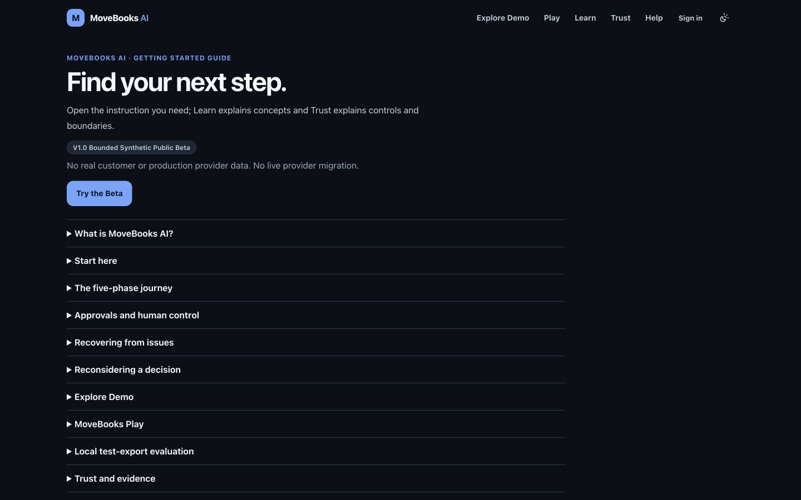
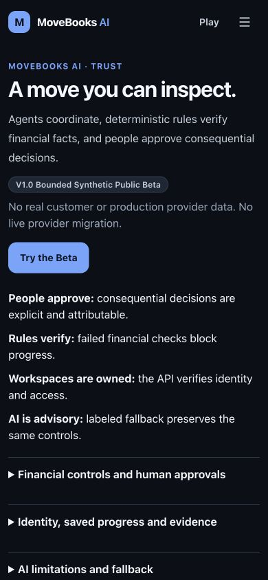

# PR02 — Public page simplification review evidence

Baseline: `eb41081a1f3c98b3096e30f38b0eeef183324459`. Branch: `feature/ux-v2-public-content`. PR #30 was verified merged into this main commit; all seven jobs of its CI run [38058275985](https://github.com/JEMathew/movers-and-ledgers/actions/runs/38058275985) completed successfully. The new worktree was clean before implementation. No merge or deployment performed for PR02.

## Approved scope and behavior

Uses the five completed local IA/UX v2.0 deliverables and PR01 review evidence. [Design input hashes](design-inputs.json) identify those artifacts. Implements PR02 only, including its explicitly approved cloud-facing local-export boundary.

- Compact public frame: clear purpose, one sentence of value, visible synthetic-data restriction and one main task action. Body/detail text stays 16px, reference paragraphs use a 70ch maximum, and native disclosure targets are at least 44px. Optional details remain readable; financial consent screens are unchanged.
- Guide owns practical instructions; Learn owns ten retained concepts; Trust explains financial controls, human decisions, workspace access, AI/fallback and full synthetic Beta limits. Twelve Guide IDs, ten Learn IDs and `#beta-limitations` remain. Requested sections open and focus, including same-page client links, keyboard interaction and history navigation.
- Plain `/product` temporarily redirects to Home with HTTP 307, independent of identity or stored selection. Explicit session references retain a compact compatibility reader with current-phase continuation and refresh. Invalid/missing evidence never automatically starts a replacement sample. Forwarding/retiring these references remains deferred until PR04's workspace-error dependency is satisfied, as approved in the implementation plan.
- Explore Demo remains the existing public sample introduction, pending PR03's read-only tour. Its primary sample action uses the existing `/sign-in?next=/assess?sample=…` contract, preserving the sample destination. The direct sample deep link remains under details for signed-in users. Browser QA showed that direct Assess alone displays a public chooser in cloud mode; its API operations still require identity. No assessment was started.
- Plain `/trust` never mounts a selected-session reader. Legacy `/trust?session=…` and explicit `/trust?view=evidence` retain evidence access through verified cloud identity and the unchanged authorized read/projection. Evidence is a snapshot with refresh, all existing trace categories, bounded record display and no fabricated success. Query-aware page rendering handles transitions between public/evidence views without an identity-cached redirect.
- Help distinguishes the chosen issue's destination from the original task. The selected issue opens the appropriate phase when a safe reference exists, or the related concept otherwise; returning to the original task is separately labeled. It performs no repair, retry or approval.
- Feedback remains a local **NOT_SUBMITTED** draft. Message/privacy confirmation stay visible; type/category and optional whitelisted context are disclosed when requested. The existing validation, review, clear and download capabilities remain. No staffed inbox, delivery or response commitment is implied.
- Cloud `/try-your-data` offers an unavailable-capability boundary with no picker, template download or Validate promise. Local evaluation retains its original chooser, template, file/row/size limits, validation/repair/report, review and same-package handoff controls.

Home, shared PR01 navigation, Account/auth provider, migration workflow/financial code, Play exercise and original Product Vision video/poster are unchanged. Play remains directly discoverable; contextual learning links are added in Guide, Learn and Demo. No future five-mission pixel game or guided tour is implemented or claimed.

## Density and first viewport

Rendered **main** text with optional disclosures closed, excluding the shared header/footer. Heights are complete document heights in pixels. Screenshots and measurements are genuine local captures on 2026-10-10, signed out with public Firebase configuration and no upstream backend. Before uses the baseline development frontend; after uses the final locally built production frontend. Same browser, dark System appearance and viewport dimensions. Development tooling can appear in before images. These are not deployed changes or authenticated account screenshots.

| Route | Visible words before → after | Desktop page height | Mobile page height | Desktop primary bottom | Mobile primary bottom |
| --- | --- | --- | --- | --- | --- |
| `/product` | 238 → 154 | 1856 → 1889 | 2916 → 1772 | 699 → 444 | 661 → 426 |
| `/simulator` | 210 → 98 | 1414 → 1087 | 2094 → 1252 | 1000 → 371 | 1579 → 432 |
| `/guide` | 1497 → 80 | 7855 → 1248 | 12259 → 1330 | 528 → 371 | 608 → 398 |
| `/learn` | 163 → 100 | 1679 → 1262 | 2549 → 1412 | 588 → 343 | 576 → 370 |
| `/trust` | 220 → 89 | 1707 → 1063 | 2272 → 1242 | 1395 → 371 | 1920 → 398 |
| `/support` | 165 → 131 | 1376 → 1082 | 1684 → 1306 | 922 → 442 | 1012 → 469 |
| `/feedback` | 173 → 99 | 1436 → 1087 | 1690 → 1257 | 1040 → 689 | 1214 → 779 |
| `/try-your-data` | 165 → 49 | 1663 → 900 | 1860 → 844 | 1106 → 343 | 1100 → 404 |

Desktop 1440×900; mobile 390×844. Additional 768×1024 and 320×568 cases are in [viewport measurements](viewport-metrics.json). No horizontal overflow in any of the 32 final route/viewport combinations. Every main action is within the first viewport at desktop, tablet and 390px mobile. At 320×568, seven of eight entries have their action visible; Feedback requires scrolling (action bottom 866px) because the input, privacy restriction and sensitive-data confirmation remain before submission. This practical exception is explicit, rather than hiding the confirmation or shrinking text.

`/product` now lands on the existing Home, so its row compares different page purposes; it is an alias consolidation, not an assertion that Home's total document height decreased. Its desktop document height slightly increases while the main launch moves earlier. No substantive material is claimed removed merely because a disclosure is closed.

## Before and after screenshots

All seven requested routes plus the approved cloud export boundary; each has desktop/mobile captures. JPEG bytes are saved directly from the browser without fabricated content or image editing.

| Route | Desktop before / after | Mobile before / after |
| --- | --- | --- |
| `/product` | [Before](before-product-desktop.jpg) / [After](after-product-desktop.jpg) | [Before](before-product-mobile.jpg) / [After](after-product-mobile.jpg) |
| `/simulator` | [Before](before-simulator-desktop.jpg) / [After](after-simulator-desktop.jpg) | [Before](before-simulator-mobile.jpg) / [After](after-simulator-mobile.jpg) |
| `/guide` | [Before](before-guide-desktop.jpg) / [After](after-guide-desktop.jpg) | [Before](before-guide-mobile.jpg) / [After](after-guide-mobile.jpg) |
| `/learn` | [Before](before-learn-desktop.jpg) / [After](after-learn-desktop.jpg) | [Before](before-learn-mobile.jpg) / [After](after-learn-mobile.jpg) |
| `/trust` | [Before](before-trust-desktop.jpg) / [After](after-trust-desktop.jpg) | [Before](before-trust-mobile.jpg) / [After](after-trust-mobile.jpg) |
| `/support` | [Before](before-support-desktop.jpg) / [After](after-support-desktop.jpg) | [Before](before-support-mobile.jpg) / [After](after-support-mobile.jpg) |
| `/feedback` | [Before](before-feedback-desktop.jpg) / [After](after-feedback-desktop.jpg) | [Before](before-feedback-mobile.jpg) / [After](after-feedback-mobile.jpg) |
| `/try-your-data` | [Before](before-try-your-data-desktop.jpg) / [After](after-try-your-data-desktop.jpg) | [Before](before-try-your-data-mobile.jpg) / [After](after-try-your-data-mobile.jpg) |

## Acceptance and validation

| Check | Result / evidence |
| --- | --- |
| Baseline frontend suite | 40 files / 456 tests passed |
| Final frontend suite | `npm test -- --reporter=dot`: 41 files / 499 tests passed |
| Lint / typecheck / production build | `npm run lint`, `npm run typecheck`, `npm run build`: all passed; existing routes still build |
| Links / paths / whitespace | `python3 scripts/repository_checks.py` and `git diff --check` passed; 29 rendered page/fragment destinations inspected in the browser, no missing heading or hash target |
| Keyboard / focus | Mobile Enter opens Menu and focuses Demo; Escape returns focus. Native Enter toggles details. Requested Learn/Guide/Beta sections open/focus. Observed 3px outline, 48px summary and 16px detail body |
| Public/private Trust | Plain Trust with saved pointer sends no session request; explicit mode gates cloud identity; tests retain legacy reads, invalid references, 401/404/500 outcomes, redacted evidence and private-view clearing on identity loss |
| Local/cloud intake | New cloud no-chooser/no-validation/no-request test passes; all existing local intake/limits/review/repair/handoff tests pass |
| Feedback | Unsent marker, 10–1500 characters, privacy confirmation, context whitelist/opt-in, reviewed download and clearing tests pass; no external delivery introduced |
| Existing migration navigation | Unchanged journey/owner/financial/approval/FPU, selected-context, member shell and legacy-route frontend tests remain passing |
| Provider-neutral / IP / media | Footer, original Home/video/poster and semantic palette unchanged; [source checks](source-checks.json) identify unchanged contracts and capabilities. Existing [PR01 contrast evidence](../pr01/source-checks.json) applies to the unchanged palette |

[Browser checks](browser-checks.json) distinguish actual public navigation, sign-in boundaries, focus and fragment behavior from source/unit evidence. No Google sign-in, live private read, sample creation, migration mutation or real financial data was used. Authenticated layout/behavior is source and test verified, not live authenticated visual validation. The locally built frontend also served all measured public pages; the existing start script emits an inherited standalone-output warning, without blocking these page checks. No Docker or cloud commands were run.

## Remaining limits, risks and rollback

- PR04 must resolve workspace error handling before retiring session-bearing Product compatibility links. PR03 owns the future signed-out guided Demo; future Play missions remain separate.
- Feedback's shortest viewport needs scrolling through its material privacy/form controls. Formal screen-reader, actual 200% browser zoom, real-device and five-second comprehension studies remain acceptance follow-ups; viewport simulation and passing unit tests do not establish those outcomes.
- Query-dependent Product/Trust pages are rendered dynamically. Existing server/hosting configuration is unchanged; deployed behavior was intentionally not tested or altered. Review authenticated evidence transitions and incoming links before release.
- Mandatory CI results are reported on the PR. No gates are weakened or bypassed; no automatic merge/deploy. Any inherited/out-of-scope failure must be recorded separately under the bounded investigation policy.

Observability: existing workflow audit/events and analytics contracts unchanged; this PR adds review evidence, not new telemetry. Failure modes keep the original task authoritative and never auto-replace a failed reference. Rollback is a scoped frontend revert; no financial data, backend contracts or cloud settings need reversal.
